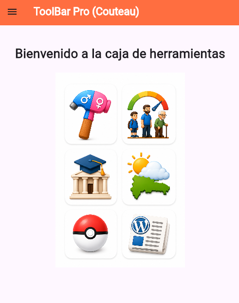
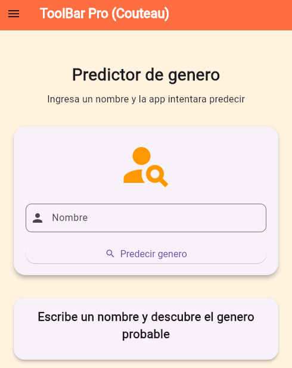
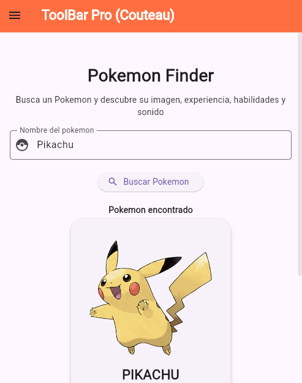

# MultiAPI (toolbar) Flutter App

Aplicación móvil desarrollada con Flutter que consume múltiples APIs públicas para mostrar información dinámica en tiempo real.
El proyecto integra diferentes servicios externos como predicción de género, edad, universidades, clima, noticias y datos de Pokémon en una sola aplicación.

---

## Tecnologías utilizadas

* Flutter
* Dart
* REST API
* HTTP Package
* JSON Parsing
* Stateful Widgets
* Material Design

---

## Características

* Consumo de múltiples APIs públicas
* Predicción de género por nombre
* Predicción de edad por nombre
* Consulta de universidades por país
* Consulta del clima en República Dominicana
* Visualización de noticias desde WordPress
* Información de Pokémon
* Manejo de estados de carga
* Manejo de errores
* Interfaz responsive

---

## Arquitectura del proyecto

El proyecto fue estructurado por vistas para mantener una organización clara y facilitar el mantenimiento.

```txt
lib/
 ├── main.dart
 ├── views/
 │    ├── inicio_view.dart
 │    ├── genero_view.dart
 │    ├── edad_view.dart
 │    ├── universidades_view.dart
 │    ├── clima_view.dart
 │    ├── wordpress_view.dart
 │    ├── pokemon_view.dart
 │    └── acerca_view.dart
```

---

## Funcionalidades principales

### Predicción de Género

* Entrada de nombre
* Consulta automática a API
* Resultado visual con género detectado

### Predicción de Edad

* Entrada de nombre
* Consulta a API de edad
* Clasificación por rango de edad

### Universidades

* Consulta de universidades por país
* Listado de resultados
* Visualización de dominios y sitios web

### Clima

* Consulta del clima actual
* Información meteorológica en tiempo real
* Visualización amigable

### Noticias WordPress

* Consumo de API REST de WordPress
* Visualización de últimas noticias
* Contenido dinámico

### Pokémon

* Consulta por nombre o ID
* Imagen del Pokémon
* Información básica del personaje

---

## APIs utilizadas

* Genderize API
* Agify API
* Universities API
* Weather API
* WordPress REST API
* PokéAPI

---

## Aprendizajes del proyecto

Durante el desarrollo de esta aplicación se reforzaron conocimientos en:

* Consumo de APIs REST
* Manejo de peticiones HTTP
* Parseo de JSON
* Manejo de estados en Flutter
* Diseño de interfaces móviles
* Manejo de errores y excepciones

---

## Imágenes del proyecto

## Pantalla principal



## Predicción de género



## Consulta de Pokémon



---

## Mejoras futuras
* Implementar Provider / Riverpod
* Mejorar arquitectura (MVC / Clean)
* Cache local
* Dark mode

## Autor

Desarrollado por Stwart Amarante.
